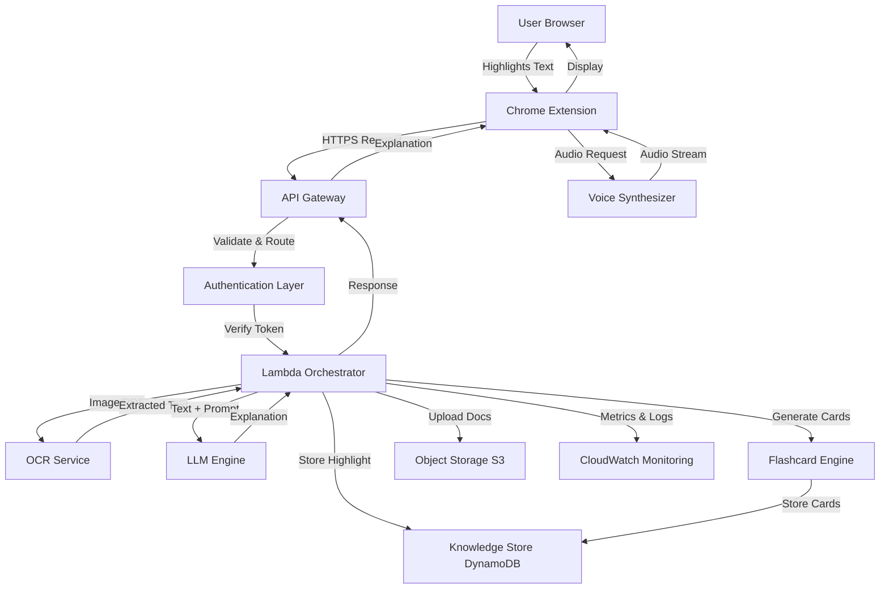

# Design Document: AI "Touch-to-Explain" Learning Assistant

## Overview

The AI "Touch-to-Explain" Learning Assistant is a serverless, event-driven system that provides real-time explanations of highlighted text within the user's learning context. The architecture leverages Chrome Extension APIs for client-side interaction, AWS API Gateway for request routing, Lambda for orchestration, and various AWS services for content processing, storage, and monitoring.

The system follows a request-response pattern where user interactions trigger a pipeline of processing steps: authentication → content type detection → OCR (if needed) → AI explanation generation → knowledge graph update → flashcard generation → response delivery. All operations are designed to complete within 10 seconds to maintain a seamless learning experience.

## Architecture

### High-Level Architecture



### Architectural Principles

1. **Serverless-First**: All compute is serverless (Lambda) to minimize operational overhead and enable automatic scaling
2. **Event-Driven**: Each user action triggers a discrete event that flows through the system
3. **Separation of Concerns**: Clear boundaries between client (Chrome Extension), API layer (API Gateway), orchestration (Lambda), and services (OCR, LLM, Storage)
4. **Data Isolation**: User data is strictly partitioned using user identifiers from authentication tokens
5. **Fail-Safe**: Explanation delivery is prioritized; non-critical operations (flashcard generation, storage) fail gracefully
6. **Observability**: All operations emit metrics and logs for monitoring and debugging

## Components and Interfaces

### 1. Chrome Extension (Client)

**Responsibilities:**
- Detect text highlighting events using browser Selection API
- Display popup UI with explanation depth options
- Send explanation requests to API Gateway
- Render explanations in an overlay
- Request and play audio explanations
- Handle client-side errors and retries

**Key Interfaces:**
```typescript
interface ExplanationRequest {
  text: string;
  depth: 'very-short' | 'normal' | 'detailed';
  contentType: 'text' | 'image' | 'pdf';
  userId: string;
  timestamp: number;
}

interface ExplanationResponse {
  explanation: string;
  audioUrl?: string;
  conceptId: string;
  error?: string;
}
```

**Technology Stack:**
- Manifest V3 Chrome Extension
- JavaScript/TypeScript
- Chrome Storage API for caching
- Fetch API for HTTP requests

### 2. API Gateway

**Responsibilities:**
- Expose REST endpoints for explanation requests, document uploads, and learning analytics
- Validate request schemas
- Apply rate limiting and throttling
- Route requests to Lambda functions
- Handle CORS for cross-origin requests

**Endpoints:**
```
POST /api/v1/explain
  - Request: ExplanationRequest
  - Response: ExplanationResponse
  - Rate Limit: 100 req/sec per user

POST /api/v1/documents
  - Request: Multipart file upload
  - Response: { documentId: string, url: string }
  - Max Size: 10MB

GET /api/v1/learning-summary
  - Query: userId, startDate, endDate
  - Response: { topConcepts: Concept[], totalHighlights: number }

GET /api/v1/flashcards
  - Query: userId
  - Response: { flashcards: Flashcard[] }
```

**Configuration:**
- Request timeout: 29 seconds (AWS limit)
- Throttling: 100 requests/sec per user, 10,000 requests/sec system-wide
- Authentication: JWT token validation via Lambda authorizer

### 3. Lambda Orchestrator

**Responsibilities:**
- Verify authentication tokens and extract user identity
- Detect content type from request payload
- Route to OCR service for images/PDFs
- Invoke LLM engine with text and depth preference
- Store highlights in Knowledge Store
- Trigger flashcard generation for frequently highlighted concepts
- Aggregate responses and return to API Gateway
- Implement retry logic and circuit breakers

**Processing Flow:**
```python
def handle_explanation_request(event):
    # 1. Extract and validate request
    request = parse_request(event)
    user_id = verify_token(request.token)
    
    # 2. Content type detection and OCR
    if request.content_type in ['image', 'pdf']:
        text = invoke_ocr_service(request.content)
    else:
        text = request.text
    
    # 3. Generate explanation
    explanation = invoke_llm_engine(text, request.depth)
    
    # 4. Store in knowledge graph (async, non-blocking)
    store_highlight_async(user_id, text, explanation)
    
    # 5. Check for flashcard generation (async)
    check_flashcard_threshold_async(user_id, text)
    
    # 6. Return response
    return {
        'explanation': explanation,
        'conceptId': generate_concept_id(text)
    }
```

**Technology Stack:**
- Python 3.11 runtime
- boto3 for AWS service integration
- Retry logic with exponential backoff
- Circuit breaker pattern for external services

### 4. OCR Service

**Responsibilities:**
- Extract text from images and scanned PDFs
- Handle multiple image formats (PNG, JPEG, PDF)
- Return extracted text with confidence scores
- Provide warnings for low-quality images

**Implementation:**
- AWS Textract for OCR processing
- Asynchronous invocation for large documents
- Confidence threshold: 95% for production use

**Interface:**
```python
def extract_text(image_bytes: bytes, format: str) -> OCRResult:
    """
    Extract text from image or PDF.
    
    Returns:
        OCRResult with extracted text and confidence score
    """
    pass

class OCRResult:
    text: str
    confidence: float
    warnings: List[str]
```

### 5. LLM Engine

**Responsibilities:**
- Generate explanations at specified depth levels
- Simplify complex concepts using examples
- Avoid jargon and use accessible language
- Handle context windows and token limits

**Prompt Engineering:**
```python
PROMPT_TEMPLATES = {
    'very-short': """
    Explain this concept in 2-3 lines (50-100 words):
    {text}
    
    Use simple language and focus on the core idea.
    """,
    
    'normal': """
    Explain this concept in a paragraph (100-200 words):
    {text}
    
    Include:
    - What it is
    - Why it matters
    - A simple example
    """,
    
    'detailed': """
    Provide a detailed explanation (200-400 words):
    {text}
    
    Include:
    - Clear definition
    - Step-by-step breakdown
    - Multiple examples
    - Common misconceptions
    - Practical applications
    """
}
```

**Implementation Options:**
- AWS Bedrock (Claude, Llama)
- OpenAI API (GPT-4)
- Self-hosted model on SageMaker

**Configuration:**
- Temperature: 0.7 for balanced creativity
- Max tokens: 500 (very-short), 1000 (normal), 2000 (detailed)
- Timeout: 5 seconds with retry

### 6. Knowledge Store (DynamoDB)

**Responsibilities:**
- Store user highlights with explanations
- Track highlight frequency per concept
- Support queries by user, topic, and timestamp
- Maintain data isolation between users

**Schema:**

**Highlights Table:**
```
Primary Key: userId (Partition Key) + timestamp (Sort Key)
Attributes:
  - highlightId: UUID
  - text: String (highlighted text)
  - explanation: String (AI-generated)
  - depth: String (very-short | normal | detailed)
  - topicCategory: String (auto-detected)
  - conceptId: String (normalized concept identifier)
  - frequency: Number (how many times this concept highlighted)
  - createdAt: Timestamp
  - updatedAt: Timestamp

GSI: conceptId-userId-index
  - Partition Key: conceptId
  - Sort Key: userId
  - Purpose: Query all highlights for a specific concept
```

**Flashcards Table:**
```
Primary Key: userId (Partition Key) + flashcardId (Sort Key)
Attributes:
  - conceptId: String
  - front: String (concept/question)
  - back: String (explanation)
  - createdAt: Timestamp
  - lastReviewed: Timestamp
  - reviewCount: Number
  - difficulty: Number (1-5)

GSI: conceptId-index
  - Partition Key: conceptId
  - Purpose: Avoid duplicate flashcards
```

**Access Patterns:**
1. Get all highlights for a user (userId query)
2. Get highlights for a specific concept (conceptId GSI)
3. Get flashcards for a user (userId query)
4. Check if flashcard exists for concept (conceptId GSI)

### 7. Flashcard Engine

**Responsibilities:**
- Monitor highlight frequency per concept
- Automatically generate flashcards when threshold is met (3+ highlights)
- Avoid duplicate flashcards
- Format flashcards for spaced repetition

**Logic:**
```python
def check_and_generate_flashcard(user_id: str, concept_id: str):
    # Query highlight frequency
    frequency = get_concept_frequency(user_id, concept_id)
    
    # Check threshold
    if frequency >= 3:
        # Check if flashcard already exists
        existing = get_flashcard(user_id, concept_id)
        if not existing:
            # Get most recent explanation
            explanation = get_latest_explanation(user_id, concept_id)
            
            # Create flashcard
            flashcard = {
                'userId': user_id,
                'conceptId': concept_id,
                'front': extract_concept_name(concept_id),
                'back': explanation,
                'createdAt': now(),
                'reviewCount': 0,
                'difficulty': 3  # Medium difficulty default
            }
            
            store_flashcard(flashcard)
```

### 8. Voice Synthesizer

**Responsibilities:**
- Convert explanation text to natural-sounding speech
- Support multiple voice options
- Stream audio to client
- Handle text preprocessing (abbreviations, technical terms)

**Implementation:**
- AWS Polly for text-to-speech
- Neural voices for natural sound
- MP3 format for browser compatibility

**Interface:**
```python
def synthesize_speech(text: str, voice: str = 'Joanna') -> AudioStream:
    """
    Convert text to speech.
    
    Args:
        text: Explanation text
        voice: AWS Polly voice name
    
    Returns:
        Audio stream in MP3 format
    """
    pass
```

### 9. Object Storage (S3)

**Responsibilities:**
- Store uploaded PDFs and documents
- Serve processed documents
- Maintain user document library
- Implement lifecycle policies for cost optimization

**Bucket Structure:**
```
ai-learning-assistant-documents/
  ├── {userId}/
  │   ├── uploads/
  │   │   ├── {documentId}.pdf
  │   │   └── {documentId}.png
  │   └── processed/
  │       └── {documentId}.txt
```

**Configuration:**
- Encryption: AES-256 at rest
- Versioning: Enabled
- Lifecycle: Move to Glacier after 90 days
- Access: Pre-signed URLs with 1-hour expiration

### 10. Monitoring System (CloudWatch)

**Responsibilities:**
- Track API latency and throughput
- Log errors with context
- Count Lambda invocations
- Alert on anomalies
- Provide dashboards for system health

**Metrics:**
- API Gateway: Request count, latency (p50, p95, p99), error rate
- Lambda: Invocation count, duration, errors, throttles
- DynamoDB: Read/write capacity, throttled requests
- LLM Engine: Response time, token usage, error rate

**Alarms:**
- API latency > 10 seconds
- Error rate > 5% over 5 minutes
- Lambda throttling detected
- DynamoDB capacity exceeded

## Data Models

### Highlight

```typescript
interface Highlight {
  highlightId: string;        // UUID
  userId: string;             // From auth token
  text: string;               // Highlighted text (max 10KB)
  explanation: string;        // AI-generated explanation
  depth: 'very-short' | 'normal' | 'detailed';
  topicCategory: string;      // Auto-detected (e.g., "programming", "math")
  conceptId: string;          // Normalized concept identifier
  frequency: number;          // Highlight count for this concept
  createdAt: number;          // Unix timestamp
  updatedAt: number;          // Unix timestamp
}
```

### Flashcard

```typescript
interface Flashcard {
  flashcardId: string;        // UUID
  userId: string;             // From auth token
  conceptId: string;          // Links to highlights
  front: string;              // Concept/question
  back: string;               // Explanation
  createdAt: number;          // Unix timestamp
  lastReviewed: number;       // Unix timestamp
  reviewCount: number;        // Number of reviews
  difficulty: number;         // 1-5 scale
}
```

### Document

```typescript
interface Document {
  documentId: string;         // UUID
  userId: string;             // From auth token
  fileName: string;           // Original filename
  fileSize: number;           // Bytes
  contentType: string;        // MIME type
  s3Key: string;              // S3 object key
  uploadedAt: number;         // Unix timestamp
  processedAt?: number;       // Unix timestamp (after OCR)
  status: 'uploaded' | 'processing' | 'ready' | 'failed';
}
```

### LearningAnalytics

```typescript
interface LearningAnalytics {
  userId: string;
  topConcepts: Array<{
    conceptId: string;
    name: string;
    frequency: number;
    category: string;
  }>;
  totalHighlights: number;
  flashcardCount: number;
  dateRange: {
    start: number;
    end: number;
  };
}
```


## Correctness Properties

A property is a characteristic or behavior that should hold true across all valid executions of a system—essentially, a formal statement about what the system should do. Properties serve as the bridge between human-readable specifications and machine-verifiable correctness guarantees.

### Property 1: Request Structure Validation

*For any* incoming request to the API Gateway, if the request structure is invalid according to the schema, then the API Gateway should return a 400 error with a descriptive message; if valid, the request should be forwarded to the Lambda Orchestrator.

**Validates: Requirements 2.1, 2.2**

### Property 2: Authentication Token Verification

*For any* request received by the Lambda Orchestrator, the authentication token must be verified, and if the token is invalid or expired, a 401 error should be returned; if valid, the user identifier should be successfully extracted from the token.

**Validates: Requirements 3.1, 3.2, 3.3**

### Property 3: User Data Isolation

*For any* data operation (query, store, update), the operation should only access data belonging to the authenticated user, and any attempt to access another user's data should result in a 403 error.

**Validates: Requirements 3.4, 3.5, 7.6**

### Property 4: Content Type Detection and Routing

*For any* request payload, the Lambda Orchestrator should correctly detect the content type, and if the content type is unsupported, return a 415 error with a list of supported formats.

**Validates: Requirements 4.1, 4.4**

### Property 5: Explanation Length Constraints

*For any* text input and depth preference, the generated explanation should conform to the length constraints: "very-short" produces 50-100 words, "normal" produces 100-200 words, and "detailed" produces 200-400 words.

**Validates: Requirements 6.2, 6.3, 6.4**

### Property 6: Service Retry Logic

*For any* external service call (LLM Engine, Knowledge Store) that fails, the Lambda Orchestrator should retry the operation according to the retry policy (once for LLM, up to 3 times with exponential backoff for storage) before returning an error.

**Validates: Requirements 6.7, 7.4, 14.2**

### Property 7: Highlight Storage Completeness

*For any* generated explanation, the Lambda Orchestrator should store a highlight record in the Knowledge Store containing all required fields: highlighted text, AI explanation, topic category, timestamp, user identifier, and concept ID.

**Validates: Requirements 7.1, 7.2**

### Property 8: Concept Frequency Tracking

*For any* concept that is highlighted, if the concept has been highlighted before by the same user, the frequency counter in the Knowledge Store should be incremented correctly.

**Validates: Requirements 7.3**

### Property 9: Knowledge Store Query Isolation

*For any* query to the Knowledge Store by user, topic, or timestamp, the results should only include data belonging to the querying user and should match the query criteria.

**Validates: Requirements 7.5**

### Property 10: Flashcard Generation Threshold

*For any* concept highlighted by a user, if the concept has been highlighted 3 or more times, a flashcard should be automatically created with the concept as the front and the explanation as the back, and duplicate flashcards for the same concept should not be created.

**Validates: Requirements 8.1, 8.2, 8.3, 8.4**

### Property 11: Graceful Flashcard Failure

*For any* flashcard generation failure, the Lambda Orchestrator should log the error but still return the explanation response to the user without blocking.

**Validates: Requirements 8.5**

### Property 12: Document Upload and Storage

*For any* valid document upload (under 10MB), the Lambda Orchestrator should store the document in Object Storage and generate a unique identifier that is different from all other document identifiers.

**Validates: Requirements 10.1, 10.3, 10.4**

### Property 13: Error Message Propagation

*For any* backend service failure (OCR, LLM, Storage), the Lambda Orchestrator should return a user-friendly error message to the client that describes the issue without exposing internal system details.

**Validates: Requirements 5.4, 9.5, 10.5, 14.1**

### Property 14: Knowledge Store Graceful Degradation

*For any* request where the Knowledge Store is unavailable, the Lambda Orchestrator should still return the explanation to the user and log the storage failure for later retry.

**Validates: Requirements 14.3**

### Property 15: Circuit Breaker Behavior

*For any* external service that experiences repeated failures, the Lambda Orchestrator's circuit breaker should open after a threshold of failures and prevent further calls until a timeout period expires.

**Validates: Requirements 14.5**

### Property 16: Learning Summary Ranking

*For any* user's learning summary request, the Lambda Orchestrator should return the top 10 most frequently highlighted concepts ranked by frequency in descending order, categorized by topic.

**Validates: Requirements 13.2, 13.3**

### Property 17: Monitoring Metrics Collection

*For any* API request, the Monitoring System should track latency, and for any error, the system should log the error with stack trace and request context, and Lambda invocations should be counted per user and endpoint.

**Validates: Requirements 12.1, 12.2, 12.3**

### Property 18: Request Payload Validation

*For any* request sent by the Chrome Extension, if a depth option is selected, the request should contain both the highlighted text and the depth preference in the correct format.

**Validates: Requirements 1.4**

### Property 19: Response Delivery Completeness

*For any* completed explanation processing, the response sent through API Gateway should contain the explanation text and be displayed in the Chrome Extension overlay without causing page navigation or refresh.

**Validates: Requirements 11.1, 11.2, 11.5**

### Property 20: Audio Request Handling

*For any* "Listen" button click in the Chrome Extension, an audio request should be sent to the Voice Synthesizer, and if audio generation fails, an error message should be displayed while keeping the text explanation visible.

**Validates: Requirements 9.2, 9.5**

### Property 21: Popup Interaction Behavior

*For any* user click outside the explanation popup, the Chrome Extension should close the popup without affecting the underlying page state.

**Validates: Requirements 11.4**

### Property 22: Timeout Retry UI

*For any* network timeout that occurs during a request, the Chrome Extension should display a retry option to the user.

**Validates: Requirements 14.4**

## Error Handling

### Error Categories

1. **Client Errors (4xx)**
   - 400 Bad Request: Invalid request structure
   - 401 Unauthorized: Invalid or expired token
   - 403 Forbidden: Insufficient permissions
   - 413 Payload Too Large: Document exceeds 10MB
   - 415 Unsupported Media Type: Unsupported content type
   - 429 Too Many Requests: Rate limit exceeded

2. **Server Errors (5xx)**
   - 500 Internal Server Error: Unexpected Lambda error
   - 502 Bad Gateway: Downstream service failure
   - 503 Service Unavailable: Service temporarily unavailable
   - 504 Gateway Timeout: Request timeout (>29 seconds)

### Error Handling Strategies

**Retry Logic:**
- LLM Engine failures: Retry once immediately
- Knowledge Store failures: Retry up to 3 times with exponential backoff (1s, 2s, 4s)
- OCR Service failures: No retry (expensive operation)
- API Gateway timeouts: Client-side retry with user confirmation

**Circuit Breaker:**
- Threshold: 5 consecutive failures
- Timeout: 30 seconds
- Half-open state: Allow 1 test request after timeout
- Applies to: LLM Engine, OCR Service, Voice Synthesizer

**Graceful Degradation:**
- If Knowledge Store fails: Return explanation, log error, queue for later storage
- If Flashcard Engine fails: Return explanation, log error, skip flashcard creation
- If Voice Synthesizer fails: Return text explanation, show error message for audio

**Error Messages:**
- User-facing: Simple, actionable messages (e.g., "Unable to process image. Please try a clearer image.")
- Internal logs: Detailed error with stack trace, request ID, user ID, timestamp
- Never expose: Internal service names, stack traces, database details

### Timeout Configuration

- Chrome Extension → API Gateway: 10 seconds
- API Gateway → Lambda: 29 seconds (AWS limit)
- Lambda → OCR Service: 5 seconds
- Lambda → LLM Engine: 5 seconds
- Lambda → Knowledge Store: 2 seconds
- Lambda → Voice Synthesizer: 3 seconds

## Testing Strategy

### Dual Testing Approach

This system requires both unit tests and property-based tests to ensure comprehensive correctness:

**Unit Tests** verify specific examples, edge cases, and error conditions:
- Specific authentication token formats (valid JWT, expired JWT, malformed token)
- Boundary conditions (exactly 10MB document, 10KB text payload)
- Error scenarios (OCR service down, LLM timeout, storage failure)
- Integration points (API Gateway → Lambda, Lambda → DynamoDB)

**Property-Based Tests** verify universal properties across all inputs:
- Request validation works for any invalid request structure
- Authentication works for any token format
- Data isolation holds for any user and any data operation
- Explanation length constraints hold for any text input
- Retry logic works for any service failure pattern

Both testing approaches are complementary and necessary for production readiness.

### Property-Based Testing Configuration

**Framework:** Hypothesis (Python) for Lambda functions, fast-check (TypeScript) for Chrome Extension

**Test Configuration:**
- Minimum iterations: 100 per property test
- Shrinking: Enabled to find minimal failing examples
- Seed: Randomized but logged for reproducibility

**Test Tagging:**
Each property test must include a comment referencing the design property:
```python
# Feature: ai-learning-assistant, Property 1: Request Structure Validation
@given(st.dictionaries(st.text(), st.text()))
def test_request_validation(request_data):
    # Test implementation
    pass
```

### Unit Testing Strategy

**Chrome Extension Tests:**
- Test highlighting detection with various text selections
- Test popup rendering with different explanation lengths
- Test audio playback with mock audio streams
- Test error UI with various error messages
- Framework: Jest + Chrome Extension Testing Library

**Lambda Orchestrator Tests:**
- Test content type detection with various payloads
- Test authentication with valid/invalid tokens
- Test retry logic with mock service failures
- Test circuit breaker state transitions
- Framework: pytest + moto (AWS mocking)

**Integration Tests:**
- End-to-end flow: Highlight → Explanation → Storage → Flashcard
- API Gateway → Lambda → DynamoDB round trip
- OCR processing with sample images
- LLM integration with real API calls (limited)
- Framework: pytest + localstack (local AWS)

### Test Data Generators

**For Property-Based Tests:**

```python
# Generate random highlights
@st.composite
def highlight_text(draw):
    return draw(st.text(min_size=10, max_size=10000))

# Generate random depth preferences
depth_strategy = st.sampled_from(['very-short', 'normal', 'detailed'])

# Generate random user IDs
user_id_strategy = st.uuids().map(str)

# Generate random authentication tokens
@st.composite
def auth_token(draw, valid=True):
    if valid:
        return generate_valid_jwt(draw(user_id_strategy))
    else:
        return draw(st.one_of(
            st.just(""),
            st.text(max_size=50),
            generate_expired_jwt(draw(user_id_strategy))
        ))

# Generate random request payloads
@st.composite
def explanation_request(draw):
    return {
        'text': draw(highlight_text()),
        'depth': draw(depth_strategy),
        'contentType': draw(st.sampled_from(['text', 'image', 'pdf'])),
        'userId': draw(user_id_strategy),
        'timestamp': draw(st.integers(min_value=0))
    }
```

### Edge Cases to Test

1. **Payload size boundaries:**
   - Text exactly 10KB
   - Document exactly 10MB
   - Empty text (0 bytes)

2. **Rate limiting:**
   - Exactly 100 requests/sec
   - 101 requests/sec (should throttle)

3. **Timing boundaries:**
   - Request taking exactly 10 seconds
   - Request taking 10.1 seconds (should timeout)

4. **Frequency thresholds:**
   - Concept highlighted exactly 2 times (no flashcard)
   - Concept highlighted exactly 3 times (flashcard created)

5. **Empty data:**
   - User with no highlights requests summary
   - Query for non-existent concept

6. **Concurrent operations:**
   - Same concept highlighted simultaneously by same user
   - Multiple flashcard generation attempts for same concept

### Performance Testing

**Load Testing:**
- Simulate 1,000 concurrent users
- Target: 100 requests/sec sustained
- Measure: p50, p95, p99 latency
- Tool: Locust or Artillery

**Stress Testing:**
- Gradually increase load until system degrades
- Identify breaking point
- Verify graceful degradation

**Endurance Testing:**
- Run at 50% capacity for 24 hours
- Monitor for memory leaks
- Verify no performance degradation over time

### Monitoring and Observability in Tests

**Test Instrumentation:**
- Log all property test failures with input that caused failure
- Track test execution time
- Measure code coverage (target: >80%)
- Generate test reports with pass/fail statistics

**CI/CD Integration:**
- Run unit tests on every commit
- Run property tests on every PR
- Run integration tests before deployment
- Run performance tests weekly

### Success Criteria

**Unit Tests:**
- 100% of critical paths covered
- All edge cases tested
- All error conditions tested
- Tests run in <2 minutes

**Property-Based Tests:**
- All 22 properties implemented
- Each property runs 100+ iterations
- No false positives (flaky tests)
- Tests run in <5 minutes

**Integration Tests:**
- End-to-end flows verified
- All AWS service integrations tested
- Tests run in <10 minutes

**Performance Tests:**
- p95 latency <5 seconds
- p99 latency <10 seconds
- Error rate <1%
- System handles 100 req/sec sustained

